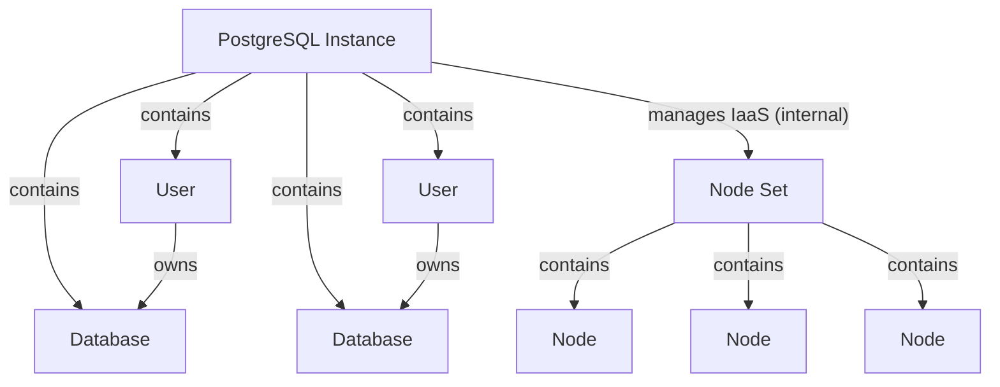

# PostgreSQL Service API



## Overview

The PostgreSQL service provides a REST-based API for creating and managing PostgreSQL database instances. It supports high availability configurations with multiple nodes, automatic failover, and comprehensive user and database management.

## Core Components

- `PostgreSQL Instance`: A logical PostgreSQL database instance
- `Database`: Logical databases within the PostgreSQL instance
- `User`: Database users with authentication and permissions

### PostgreSQL Instance (PG)

The main PostgreSQL instance entity that manages:

- Status (NEW, IN_PROGRESS, ACTIVE, ERROR)
- Configuration parameters:
    - CPU cores (1-128)
    - RAM (512MB-1TB)
    - Disk size (8GB-1TB)
    - Node count (1-16)
    - Synchronous replica count (0-15)
- Version information
- Associated databases and users

### Database

Logical databases within the PostgreSQL instance:

- Database name validation (PostgreSQL identifier rules)
- Owner assignment (must be a valid user)
- Status management

### User

Database users for authentication and access control:

- Username validation (PostgreSQL role naming rules)
- Password management with SCRAM-SHA-256 hashing
- Status

### Internal (not visible to user)

#### Node Set

Infrastructure layer that manages the underlying compute resources:

- Multiple nodes for high availability
- Root disk with PostgreSQL image
- Data disk for database storage
- Automatic failover and replication

## API Structure

### Creating a PostgreSQL Instance

```json
{
  "name": "production-postgres",
  "description": "Production PostgreSQL database",
  "cpu": 4,
  "ram": 2048,
  "disk_size": 100,
  "nodes_number": 3,
  "sync_replica_number": 1,
  "version": "/v1/types/postgres/versions/VERSION_UUID"
}
```

### Creating a User

```json
{
  "name": "app_user",
  "description": "Application database user",
  "password": "secure_password_123"
}
```

### Creating a Database

```json
{
  "name": "app_database",
  "description": "Main application database",
  "owner": "/v1/types/postgres/instances/INSTANCE_UUID/users/USER_UUID"
}
```

## Backups

Setting `backup` on an instance enables continuous WAL archiving and periodic
backups with [pgBackRest](https://pgbackrest.org/). The storage is described
in full by the user: DBaaS neither creates buckets nor manages credentials, so
the S3 lifecycle belongs to manifests and other elements.

Updating the DBaaS element doesn't reinstall the nodes of existing instances
at once. They keep the agent they were created with, which doesn't know
backups, until the first change of the instance reinstalls them from the new
image, keeping the data disk. Setting `backup` is such a change, so backups
are taken by the reinstalled nodes.

```json
{
  "backup": {
    "kind": "s3",
    "endpoint": "http://10.20.0.30:9000",
    "bucket": "dbaas-backups",
    "access_key": "backup",
    "secret_key": "secret",
    "region": "us-east-1",
    "uri_style": "path",
    "verify_tls": true,
    "path": "/exordos_db",
    "encryption_key": null,
    "full_interval_hours": 168,
    "incr_interval_hours": 24,
    "retention_full": 2
  }
}
```

- `endpoint` is `http://` or `https://` with an optional port and no path.
- `uri_style` is `path` (default, required for IP endpoints) or `host`.
- The instance uuid is the pgBackRest stanza, so instances may share a bucket
  and a `path`.
- `encryption_key` turns on repository encryption (`aes-256-cbc`). Backups
  can't be restored without it. Use it when the storage is reached over plain
  HTTP.
- A full backup is taken every `full_interval_hours`, an incremental one every
  `incr_interval_hours`; `retention_full` full backups are kept together with
  their incremental backups and WAL.
- Setting `backup` to `null` stops archiving. Backups already in the storage
  are left there.

Credentials are stored in the instance and returned by the API to everyone who
can read the instance.

On the data plane the agent renders `/etc/pgbackrest/pgbackrest.conf` on every
node, creates the stanza on the primary and sets `archive_command` through the
Patroni DCS. `exordos-db-pg-backup.timer` runs every 15 minutes on every node
and takes a backup on the primary when one is due. WAL is archived
continuously in between: whatever was written is in the storage within about
five minutes, which is what a restore to the latest moment may lose. When the
storage is unreachable WAL is kept up to a quarter of `disk_size` and dropped
after that, so the database keeps running at the cost of a gap in
point-in-time recovery.
Archiving is turned on only once the stanza is created; until then users,
databases and replication settings are applied as usual, and the agent keeps
retrying.

The read-only `backup_status` of the instance tells whether the storage can
be used, as the primary finds it:

```json
{
  "backup_status": {
    "error": "ERROR: [039]: HTTP request failed with 403 (Forbidden) ..."
  }
}
```

- `error` is why the last attempt failed: the agent creating the stanza, the
  timer reading the backups or taking one. Wrong credentials, a missing
  bucket or an unreachable storage show up here. It is `null` once an attempt
  succeeds, and is cleared when `backup` changes.
- `backup_status` is `null`, and left out by the API, while backups are off
  or before the primary has reported. A working storage gives
  `{"error": null}`.

WAL can go missing from the archive: a primary that goes down before it has
archived its last segments, WAL dropped while the storage was unreachable.
Nothing past a missing segment can be restored until a backup is taken past
it, so the timer takes one as soon as it finds such a gap, and logs the
segments that are missing. Moments between the gap and that backup can't be
restored to.

## Restoring to a Point in Time

A new instance can start from the backups of another one instead of an empty
database. `restore_from` is set on creation only; the source instance may
already be deleted, its backups are found by the storage and the stanza.

```json
{
  "name": "restored-postgres",
  "cpu": 4,
  "ram": 2048,
  "disk_size": 100,
  "nodes_number": 3,
  "sync_replica_number": 1,
  "version": "/v1/types/postgres/versions/VERSION_UUID",
  "restore_from": {
    "kind": "s3",
    "endpoint": "http://10.20.0.30:9000",
    "bucket": "dbaas-backups",
    "access_key": "backup",
    "secret_key": "secret",
    "path": "/exordos_db",
    "stanza": "SOURCE_INSTANCE_UUID",
    "target": {"kind": "time", "time": "2026-09-14T10:30:00Z"}
  }
}
```

- The storage fields and `encryption_key` are the same as in `backup` of the
  source instance.
- `stanza` is the uuid of the source instance.
- `target` is where the recovery stops:
    - `{"kind": "latest"}` (default): replay the whole archive;
    - `{"kind": "time", "time": "2026-09-14T10:30:00Z"}`: recover to that
      moment. A time in the future is rejected. It has to be after the end
      of the oldest kept full backup; a time past the last archived WAL
      recovers to the end of the archive.
- `version` and `disk_size` must fit the backup: the same PostgreSQL major
  version and enough space for the data.
- The new instance doesn't take backups unless its own `backup` is set. It
  uses its own stanza, so the source's backups stay intact even in the same
  bucket and `path`.

Patroni bootstraps the cluster with `exordos-db-pg-restore`, which runs
`pgbackrest restore`; PostgreSQL replays WAL up to the target and is promoted,
replicas are cloned from it afterwards.

The instance stays `IN_PROGRESS` until the recovery is over and its users
and databases are imported. Meanwhile the read-only `restore_status` shows
how the restore goes, `{"phase": "restoring" | "recovering" | "failed",
"error": ...}`, and is `null` once it's over. Each node attempts the restore
three times. When the restore fails on every node trying it, `error` says
why and the instance turns `ERROR`: no backup before the target, a wrong key
or stanza, an unreachable storage. Such an instance is deleted and created
again with a fixed `restore_from`.

Users and databases of the restored cluster appear in the API once the
recovery is over. Imported users have no `password` (`null`) and keep their
password hashes, so existing clients keep working; setting `password` changes
it as usual. Users without a password and databases owned by roles DBaaS
doesn't manage (e.g. `postgres`) aren't imported and get dropped.

## Validation Rules

### Instance Validation

- CPU must be between 1 and 128 cores
- RAM must be between 512MB and 1TB
- Disk size must be between 8GB and 1TB
- Node count must be between 1 and 16
- Synchronous replica count must be between 0 and 15
- Disk size shrink is not supported

### Database Validation

- Database names must follow PostgreSQL identifier rules:
    - Start with letter or underscore
    - Contain only letters, numbers, and underscores
    - Maximum length of 63 characters
- Database owner must be a valid user

### User Validation

- Usernames must follow PostgreSQL role naming rules:
    - Cannot start with "pg_", "dbaas_", or "postgres"
    - Start with letter or underscore
    - Contain only letters, numbers, underscores, and dollar signs
    - Maximum length of 63 characters
- Password must be between 8 and 99 characters

## Status Management

### Instance Status Lifecycle

1. **NEW**: Instance created, infrastructure provisioning started
2. **IN_PROGRESS**: Infrastructure being provisioned, PostgreSQL being installed
3. **ACTIVE**: Instance ready for use
4. **ERROR**: Provisioning or configuration failed

### Component Status

- Nodes: NEW → IN_PROGRESS → ACTIVE → ERROR
- Databases: NEW → ACTIVE → ERROR
- Users: NEW → ACTIVE → ERROR

## Element Manifest Example

Basic manifest for PostgreSQL instance:

```yaml
requirements:
  core:
    from_version: "0.0.0"
  dbaas:
    from_version: "0.0.0"

imports:
  pg18:
    element: "$dbaas"
    kind: "resource"
    link: "$dbaas.types.postgres.versions.$pg18"

resources:
  # Secret
  $core.secret.passwords:
    demo_db_password:
      name: demo_db_password
      description: "Demo password"

  # DBaaS
  $dbaas.types.postgres.instances:
    cluster_pg:
      name: demo-cluster
      nodes_number: 1
      project_id: "12345678-c625-4fee-81d5-f691897b8142"
      cpu: 1
      ram: 1024
      disk_size: 15
      sync_replica_number: 1
      nodes_number: 1
      version: $demo.imports.$pg18:uuid

  $dbaas.types.postgres.instances.$cluster_pg.users:
    demo_user:
      project_id: "12345678-c625-4fee-81d5-f691897b8142"
      name: demo_user
      password: $core.secret.passwords.$demo_db_password:value
      instance: $dbaas.types.postgres.instances.$cluster_pg:uuid

  $dbaas.types.postgres.instances.$cluster_pg.databases:
    demo_db:
      project_id: "12345678-c625-4fee-81d5-f691897b8142"
      name: demo_db
      owner: $dbaas.types.postgres.instances.$cluster_pg.users.$demo_user:uuid
      instance: $dbaas.types.postgres.instances.$cluster_pg:uuid

  # Configs
  $core.config.configs:
    demo_db_pass_cfg:
      ...
      body:
        kind: "text"
        content: f"
        DB_USER=$dbaas.types.postgres.instances.$cluster_pg.users.$demo_user:name
        DB_PASS=$core.secret.passwords.$demo_db_password:value
        DB_NODES=$dbaas.types.postgres.instances.$cluster_pg:to_str(ipsv4)
        "
```

## PostgreSQL Versions API

### Version Management

The `/v1/types/postgres/versions/` endpoint provides access to available PostgreSQL versions and their configurations.

#### GET /v1/types/postgres/versions/

Retrieve a list of all available PostgreSQL versions.

**Response Format:**

```json
{
  "versions": [
    {
      "uuid": "version-uuid-here",
      "name": "PostgreSQL 15.4",
      "description": "PostgreSQL 15.4 with latest security patches",
      "image": "postgres:15.4",
      "created_at": "2024-01-15T10:30:00Z",
      "updated_at": "2024-01-15T10:30:00Z"
    },
    {
      "uuid": "version-uuid-here-2",
      "name": "PostgreSQL 14.10",
      "description": "PostgreSQL 14.10 LTS version",
      "image": "postgres:14.10",
      "created_at": "2024-01-15T10:30:00Z",
      "updated_at": "2024-01-15T10:30:00Z"
    }
  ]
}
```

#### GET /v1/types/postgres/versions/{uuid}

Retrieve details for a specific PostgreSQL version.

**Response Format:**

```json
{
  "uuid": "version-uuid-here",
  "name": "PostgreSQL 15.4",
  "description": "PostgreSQL 15.4 with latest security patches",
  "image": "postgres:15.4",
  "created_at": "2024-01-15T10:30:00Z",
  "updated_at": "2024-01-15T10:30:00Z"
}
```

#### Version Selection

When creating a PostgreSQL instance, you must specify a version using its UUID:

```json
{
  "name": "production-postgres",
  "version": "/v1/types/postgres/versions/VERSION_UUID"
}
```

### Version Properties

- **UUID**: Unique identifier for the version
- **Name**: Human-readable version name
- **Description**: Detailed description of the version
- **Image**: Docker image reference used for deployment
- **Created At**: Timestamp when version was added
- **Updated At**: Timestamp of last update

### Version Lifecycle

- Versions are managed by the system administrator
- New versions can be added as PostgreSQL releases are published
- Deprecated versions may be marked for removal but remain available for existing instances
- Version updates for existing instances are planned for future releases

## API Endpoints

### Instance Management

- `POST /v1/postgres/instances` - Create new instance
- `GET /v1/postgres/instances/{uuid}` - Get instance details
- `PUT /v1/postgres/instances/{uuid}` - Update instance
- `DELETE /v1/postgres/instances/{uuid}` - Delete instance

### Database Management

- `POST /v1/postgres/instances/{uuid}/databases` - Create database
- `GET /v1/postgres/instances/{uuid}/databases` - List databases
- `GET /v1/postgres/instances/{uuid}/databases/{db_uuid}` - Get database
- `DELETE /v1/postgres/instances/{uuid}/databases/{db_uuid}` - Delete database

### User Management

- `POST /v1/postgres/instances/{uuid}/users` - Create user
- `GET /v1/postgres/instances/{uuid}/users` - List users
- `GET /v1/postgres/instances/{uuid}/users/{user_uuid}` - Get user
- `DELETE /v1/postgres/instances/{uuid}/users/{user_uuid}` - Delete user

### Version Management

- `GET /v1/types/postgres/versions` - List all available versions
- `GET /v1/types/postgres/versions/{uuid}` - Get specific version details
