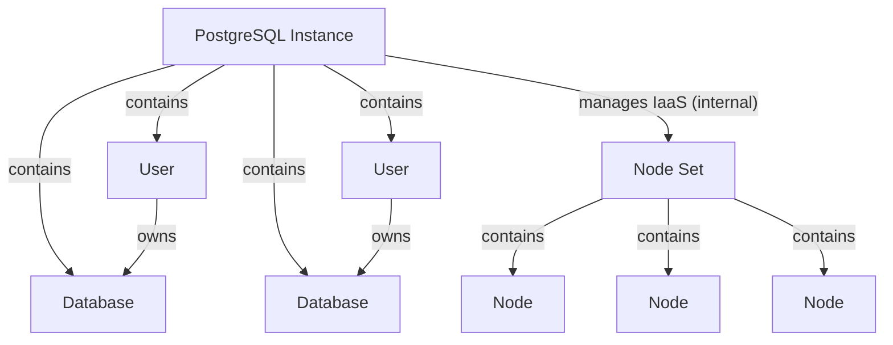

# PostgreSQL Service API



## Overview

The PostgreSQL service provides a REST-based API for creating and managing PostgreSQL database instances. It supports high availability configurations with multiple nodes, automatic failover, and comprehensive user and database management.

## Core Components

- `PostgreSQL Instance`: A logical PostgreSQL database instance
- `Database`: Logical databases within the PostgreSQL instance
- `User`: Database users with authentication and permissions

### PostgreSQL Instance (PG)

The main PostgreSQL instance entity that manages:

- Status (NEW, IN_PROGRESS, ACTIVE, ERROR)
- Configuration parameters:
    - CPU cores (1-128)
    - RAM (512MB-1TB)
    - Disk size (8GB-1TB)
    - Node count (1-16)
    - Synchronous replica count (0-15)
- Version information
- Associated databases and users

### Database

Logical databases within the PostgreSQL instance:

- Database name validation (PostgreSQL identifier rules)
- Owner assignment (must be a valid user)
- Status management

### User

Database users for authentication and access control:

- Username validation (PostgreSQL role naming rules)
- Password management with SCRAM-SHA-256 hashing
- Status

### Internal (not visible to user)

#### Node Set

Infrastructure layer that manages the underlying compute resources:

- Multiple nodes for high availability
- Root disk with PostgreSQL image
- Data disk for database storage
- Automatic failover and replication

## API Structure

### Creating a PostgreSQL Instance

```json
{
  "name": "production-postgres",
  "description": "Production PostgreSQL database",
  "cpu": 4,
  "ram": 2048,
  "disk_size": 100,
  "nodes_number": 3,
  "sync_replica_number": 1,
  "version": "/v1/types/postgres/versions/VERSION_UUID"
}
```

### Creating a User

```json
{
  "name": "app_user",
  "description": "Application database user",
  "password": "secure_password_123"
}
```

### Creating a Database

```json
{
  "name": "app_database",
  "description": "Main application database",
  "owner": "/v1/types/postgres/instances/INSTANCE_UUID/users/USER_UUID"
}
```

## Backups

Instances back up with [pgBackRest](https://pgbackrest.org/) to backup
repositories. DBaaS neither creates buckets nor manages their credentials, so
the S3 lifecycle belongs to manifests and other elements.

Updating the DBaaS element doesn't reinstall the nodes of existing instances
at once. They keep the agent they were created with, which doesn't know
backups, until the first change of the instance reinstalls them from the new
image, keeping the data disk. Setting `backup` is such a change, so backups
are taken by the reinstalled nodes.

### Backup Repositories

A repository is a place in S3 pgBackRest keeps backups in, with the
credentials to reach it: `/v1/types/postgres/backup_repositories/`. It is
created once and outlives the instances using it, so the backups of a deleted
instance can still be listed and restored.

```json
{
  "name": "dbaas-backups",
  "storage": {
    "kind": "s3",
    "endpoint": "http://10.20.0.30:9000",
    "bucket": "dbaas-backups",
    "access_key": "backup",
    "secret_key": "secret",
    "region": "us-east-1",
    "uri_style": "path",
    "verify_tls": true,
    "path": "/exordos_db"
  },
  "encryption_key": null
}
```

- `endpoint` is `http://` or `https://` with an optional port and no path. The
  storage is reached from the nodes of the instances, so loopback, link-local
  (e.g. the metadata service), unspecified and multicast addresses and
  `localhost` are rejected, in any form the nodes take them (`127.1`,
  `2130706433`, `::ffff:127.0.0.1`); private addresses are allowed. A host
  name is resolved when the repository is saved and rejected if any of its
  addresses is; a name the control plane can't resolve is accepted. Since the
  name can be pointed elsewhere afterwards, a node checks what it resolves to
  as well, and over `http` connects to the address it checked rather than to
  the name. Over `https` with `verify_tls` the certificate has to match the
  name, which ties the endpoint to its storage instead. A name a node can't
  resolve fails the backups of its instance with that in `backup_status`.
- `path` is an absolute path in the bucket without `..` segments.
- `uri_style` is `path` (default, required for IP endpoints) or `host`.
- `encryption_key` turns on repository encryption (`aes-256-cbc`). Backups
  can't be restored without it. Use it when the storage is reached over plain
  HTTP.
- Every instance keeps its backups under its own pgBackRest stanza, its uuid,
  so many instances may share a repository. They aren't isolated from each
  other in it: the nodes of every instance using a repository have its
  credentials. Instances that must not reach each other's backups need
  separate repositories, in another bucket or in another `path` with an S3
  policy limiting a key to it.
- The name and the credentials may change; the new credentials reach the nodes
  of every instance using the repository, including one being rolled back from
  it right then. The place (`endpoint`, `bucket`, `path`) and `encryption_key`
  can't change (`400`): they are what the backups are in and encrypted with.
  Create another repository instead.
- An instance may use only the repositories of its project.
- A repository used by the `backup` or `restore_from` of an instance can't be
  deleted (`409`). Deleting a repository forgets its backups in the API; the
  storage is left as it is.

The credentials are returned by the API to everyone who can read the
repository.

### Taking Backups

Setting `backup` on an instance enables continuous WAL archiving and periodic
backups to a repository.

```json
{
  "backup": {
    "kind": "repository",
    "repository": "REPOSITORY_UUID",
    "full_interval_hours": 168,
    "incr_interval_hours": 24,
    "retention": {"kind": "days", "days": 7}
  }
}
```

- A full backup is taken every `full_interval_hours`, an incremental one every
  `incr_interval_hours`.
- `retention` is what pgBackRest keeps, the rest is expired after a backup:
    - `{"kind": "days", "days": 7}` (default): enough to recover to any moment
      of the last `days` days, i.e. the full backups of that period, the newest
      one older than it, their incremental backups and WAL;
    - `{"kind": "full_backups", "count": 2}`: `count` full backups with their
      incremental backups and WAL, however old.
- Setting `backup` to `null` stops archiving. Backups already in the storage
  are left there.

Every 15 minutes `exordos-db-pg-backup.timer` takes a backup on the primary
when one is due, unless the cluster is paused for a rollback. When the storage
is unreachable WAL is kept up to a quarter of `disk_size` and dropped after
that, so the database keeps running at the cost of a gap in point-in-time
recovery.

### Backup Status and Restore Window

An instance with `backup` shows how its backups go, read-only, as the primary
reported them last (every 15 minutes, see [Listing Backups](#listing-backups)):

```json
{
  "backup_status": {
    "error": null,
    "last_backup_at": "2026-09-15T11:15:42Z",
    "last_archived_at": "2026-09-15T11:52:10Z",
    "last_archive_failed_at": null,
    "restore_window": {
      "earliest": "2026-09-08T11:00:43Z",
      "latest": "2026-09-15T11:52:10Z"
    }
  }
}
```

- `error` is why the last run of the backup timer failed: the stanza can't be
  created, the repository can't be read, the backup failed. `null` once a run
  succeeds.
- `last_backup_at` is when the newest backup without errors finished.
- `last_archived_at` and `last_archive_failed_at` are when PostgreSQL last
  archived a WAL segment and last failed to. A failure later than the last
  success means archiving is failing now, and nothing written since can be
  recovered.
- `restore_window` is what a `time` target can be: later than `earliest`, the
  end of the oldest restorable backup, and up to about `latest`, the last
  archived WAL. A WAL segment is archived when it is full or after
  `archive_timeout` (30 minutes), so `latest` may be that old. An in-place
  rollback archives the current WAL first and can go up to now; a new
  instance restored with a `latest` target gets everything archived.
  `null` while no restorable backup is known.

The API leaves out fields that are `null`.

### Listing Backups

`/v1/types/postgres/backups/` lists the backups DBaaS knows about, read-only.
Filter them by `stanza`, or by `instance` and `repository` given as URIs, e.g.
`?instance=/v1/types/postgres/instances/INSTANCE_UUID`.

```json
{
  "uuid": "BACKUP_UUID",
  "project_id": "PROJECT_UUID",
  "repository": "/v1/types/postgres/backup_repositories/REPOSITORY_UUID",
  "instance": "/v1/types/postgres/instances/INSTANCE_UUID",
  "stanza": "INSTANCE_UUID",
  "label": "20260915-101500F_20260915-111500I",
  "type": "incr",
  "before_revision": null,
  "started_at": "2026-09-15T11:15:00Z",
  "finished_at": "2026-09-15T11:15:42Z",
  "size": 52428800,
  "stored_size": 1048576,
  "restorable": true,
  "error": false,
  "created_at": "2026-09-15T11:16:30Z",
  "updated_at": "2026-09-15T11:16:30Z"
}
```

- `label` is pgBackRest's, unique within the stanza; `type` is `full`,
  `diff` or `incr`.
- `size` is the size of the backed up data, `stored_size` what the repository
  keeps for this backup (compressed, without the files of the backups it
  refers to), both in bytes.
- `before_revision` is set for a copy kept before a rollback (see
  [Undoing a Rollback](#undoing-a-rollback)); its `stanza` is
  `INSTANCE_UUID-rollbacks`.
- `restorable` is `false` for a backup a recovery can't start from: one with
  `error` (pgBackRest found e.g. page checksum errors in the copied files) or
  one on a timeline abandoned by a rollback.
- `instance` is `null` once the instance is deleted. `stanza` stays, and is
  what `restore_from` needs to restore the backups of the deleted instance.

The list is what the primary last found in the repository its `backup` goes
to: new and expired backups show up within 15 minutes and an agent iteration,
at most the 500 newest per stanza. The control plane doesn't read the storage.

The rows of an instance that is deleted, or whose `backup` is set to `null` or
moved to another place, stay as they were: pgBackRest expires backups only
when it takes a new one, so they stay true unless the storage is cleaned up by
other means. Moved to another repository of the same place, the instance gets
the rows of the new repository instead.

## Restoring to a Point in Time

A new instance can start from the backups of another one instead of an empty
database. The source instance may already be deleted, its backups are found by
the repository and the stanza.

```json
{
  "name": "restored-postgres",
  "cpu": 4,
  "ram": 2048,
  "disk_size": 100,
  "nodes_number": 3,
  "sync_replica_number": 1,
  "version": "/v1/types/postgres/versions/VERSION_UUID",
  "restore_from": {
    "kind": "repository",
    "repository": "REPOSITORY_UUID",
    "stanza": "SOURCE_INSTANCE_UUID",
    "target": {"kind": "time", "time": "2026-09-14T10:30:00Z"}
  }
}
```

- `repository` is the one the source instance backed up to, or another
  repository of the same place, e.g. with a read-only key.
- `stanza` is the uuid of the source instance, as listed in its backups.
- `target` is where the recovery stops:
    - `{"kind": "latest"}` (default): replay the whole archive;
    - `{"kind": "time", "time": "2026-09-14T10:30:00Z"}`: recover to that
      moment. A time in the future is rejected. It has to be covered by the
      archive: after the end of the oldest kept full backup and before the
      last archived WAL;
    - `{"kind": "before_revision", "revision": 1}`: the state kept before
      rollback 1 (see [Undoing a Rollback](#undoing-a-rollback)).
- `version` and `disk_size` must fit the backup: the same PostgreSQL major
  version and enough space for the data.
- The new instance doesn't take backups unless its own `backup` is set. It
  uses its own stanza, so the source's backups stay intact even in the same
  repository.

While the restore is in progress `restore_status` of the instance shows its
phase (`restoring`, `recovering`). A `time` target no listed backup of the
stanza finished before is rejected with `400`, for a new instance and for a
rollback alike; unlisted stanzas are checked on the nodes only. A restore that
can't succeed, e.g. the archive ends before the target, is attempted three
times and turns the instance into `ERROR` with the reason in
`restore_status.error`; such an instance has to be deleted and created with
another target.

### Rolling an Existing Instance Back

`restore_from` of an existing instance can be changed to roll its data back in
place, without a new instance. The cluster keeps its uuid, addresses and
backups; only the data goes back to the target time.

```json
{
  "restore_from": {
    "kind": "repository",
    "repository": "REPOSITORY_UUID",
    "stanza": "INSTANCE_UUID",
    "target": {"kind": "time", "time": "2026-09-14T10:30:00Z"},
    "revision": 1
  }
}
```

- `restore_from` is the desired origin of the data, so applying the same
  value again (e.g. re-applying a manifest) does nothing.
- A rollback happens only when the stanza, `target` or `revision` differ
  from the current source *and* `revision` is higher than any revision used
  before. Changing the target without raising `revision` is rejected with 400,
  so an edit can't roll a database back by accident. Raising `revision` with
  the same target rolls back to it again.
- `repository` can change to another repository of the same place without a
  rollback.
- `target` has to be a `time` or a `before_revision` (see
  [Undoing a Rollback](#undoing-a-rollback)): the end of the archive is the
  state the instance already has.
- `stanza` must be the instance's own uuid: another instance's backups have a
  different system identifier, restore those into a new instance.
- Setting `restore_from` to `null` leaves the data as it is. It is rejected
  with `400` until the users and databases are matched *and* `restore_status`
  is gone: the source is what the nodes are told to restore from, and what
  leaves the roles unmanaged meanwhile. The instance turns `ACTIVE` once the
  roles are matched, which the leader alone decides, while a replica may
  still be rewinding to the new timeline and still needs the source.

The leader keeps a copy of its data ([Undoing a Rollback](#undoing-a-rollback)),
restores only the files that differ from the target and recovers, and the
replicas are rewound to the new timeline. The cluster is unavailable
meanwhile and restarts once more, briefly, after it. The first backup after a
rollback is always full.

- The instance has to have `backup` set to the place of `restore_from` (the
  same endpoint, bucket and `path`, possibly through another repository), since
  the latest WAL is archived there only. Otherwise the update is rejected with
  `400`.
- Before anything is stopped the leader archives the WAL written up to now and
  checks that a backup finished before the target. If either fails, the
  rollback fails with the data untouched.
- WAL missing from the archive (backups turned off for a while, or dropped
  while the storage was unreachable) can't be recovered across: a rollback to
  a target past such a gap stops at the gap after the data has been replaced,
  and fails.
- Backups taken past the point a rollback went to, before the rollback
  itself, are on an abandoned timeline and aren't restored from, in place or
  into a new instance. They still count against a `full_backups` retention,
  and every rollback takes a full backup, so after a few rollbacks the
  earliest point to roll back to moves forward.
- `restore_status` shows the `revision` being applied and the phase of the
  leader (`paused`, `saving`, `restoring`, `restored`, `resumed`), or
  `stopped` before the leader reports and after it is done, until every
  replica replicates the new timeline.
- If the restore fails, the cluster stays paused and the instance is `ERROR`
  with the reason in `restore_status.error`; setting the source again with a
  higher `revision` starts the rollback over. `revision` has to be higher than
  every revision used before, including those of instances whose
  `restore_from` was cleared afterwards.
- A backup that is running when the rollback starts is interrupted, and no
  backup is taken while the cluster is paused.
- A target inside the interval an earlier rollback undid gives the data as
  that rollback left it: the recovery follows the latest timeline.
- A replica that can't be rewound is cloned from the leader again.
- A node that wasn't part of the cluster during the rollback (added or
  reinstalled later, or with its agent down) learns from the cluster that it
  has been applied and doesn't repeat it.
- If the node leading a rollback is gone, another node takes the rollback
  over. `nodes_number` can't be decreased while the instance is restored or
  rolled back.
- A repository that fails (wrong keys, unreachable storage) doesn't stop users,
  databases and settings from being applied.

### Undoing a Rollback

Every rollback keeps the data the leader had right before it: an offline
backup into the stanza `INSTANCE_UUID-rollbacks` of the same repository,
annotated `exordos-before-revision` with the rollback's `revision`. Set
`target` to `{"kind": "before_revision", "revision": N}` to restore it.

- In place it is a rollback like any other: raise `revision`; the target's
  `revision` must not be greater than the revisions used so far. A revision
  whose rollback kept nothing fails the rollback like a `time` target without
  a backup does. The undo keeps a copy too, so it can be undone.
- A new instance can start from it too, even after the source is deleted.
- The copy is incremental: the first rollback copies all the data while
  `restore_status.phase` is `saving`, later ones only the changed files. If
  the copy fails, the rollback fails with the data untouched.
- A rollback that failed mid-restore keeps no copy; the one before it stays
  the latest.
- Copies aren't subject to `retention` and stay until removed from the
  storage.

### Users and Databases of a Restored Cluster

Users and databases are part of the data a backup restores. While the cluster
is restored or rolled back they aren't applied (nothing is created or
dropped), the instance is `IN_PROGRESS`, and creating, changing or deleting
users and databases through the API is rejected with `409 Conflict`. Once the
recovery is over the agent reports the roles it finds, and DBaaS matches the
users and databases of the instance to them by name:

- a user or database that existed at the target time and still has a row keeps
  the row with its uuid, so manifests referring to it keep working; a user
  keeps its current `password`, which is then set again on the cluster, since
  clients and secrets already use it; a database gets back its owner;
- a user or database created after the target time loses its row;
- a user or database dropped after the target time gets a row back. Such a
  user has no `password` (`null`) and keeps its password hash, so clients
  that used it keep working; setting `password` changes it as usual.

Users without a password and databases owned by roles DBaaS doesn't manage
(e.g. `postgres`) aren't matched and get dropped. User and database names are
unique within an instance.

## Validation Rules

### Instance Validation

- CPU must be between 1 and 128 cores
- RAM must be between 512MB and 1TB
- Disk size must be between 8GB and 1TB
- Node count must be between 1 and 16
- Synchronous replica count must be between 0 and 15
- Disk size shrink is not supported

### Database Validation

- Database names must follow PostgreSQL identifier rules:
    - Start with letter or underscore
    - Contain only letters, numbers, and underscores
    - Maximum length of 63 characters
- Database owner must be a valid user

### User Validation

- Usernames must follow PostgreSQL role naming rules:
    - Cannot start with "pg_", "dbaas_", or "postgres"
    - Start with letter or underscore
    - Contain only letters, numbers, underscores, and dollar signs
    - Maximum length of 63 characters
- Password must be between 8 and 99 characters

## Status Management

### Instance Status Lifecycle

1. **NEW**: Instance created, infrastructure provisioning started
2. **IN_PROGRESS**: Infrastructure being provisioned, PostgreSQL being installed
3. **ACTIVE**: Instance ready for use
4. **ERROR**: Provisioning or configuration failed, or a restore or rollback
   failed (see `restore_status`)

`restore_status` is read-only: `{"revision", "phase", "error"}` of the restore
or rollback in progress, `null` when there is none. `revision` is `null` for
the restore of a new instance.

### Component Status

- Nodes: NEW → IN_PROGRESS → ACTIVE → ERROR
- Databases: NEW → ACTIVE → ERROR
- Users: NEW → ACTIVE → ERROR

## Element Manifest Example

Basic manifest for PostgreSQL instance:

```yaml
requirements:
  core:
    from_version: "0.0.0"
  dbaas:
    from_version: "0.0.0"

imports:
  pg18:
    element: "$dbaas"
    kind: "resource"
    link: "$dbaas.types.postgres.versions.$pg18"

resources:
  # Secret
  $core.secret.passwords:
    demo_db_password:
      name: demo_db_password
      description: "Demo password"

  # DBaaS
  $dbaas.types.postgres.instances:
    cluster_pg:
      name: demo-cluster
      nodes_number: 1
      project_id: "12345678-c625-4fee-81d5-f691897b8142"
      cpu: 1
      ram: 1024
      disk_size: 15
      sync_replica_number: 1
      nodes_number: 1
      version: $demo.imports.$pg18:uuid

  $dbaas.types.postgres.instances.$cluster_pg.users:
    demo_user:
      project_id: "12345678-c625-4fee-81d5-f691897b8142"
      name: demo_user
      password: $core.secret.passwords.$demo_db_password:value
      instance: $dbaas.types.postgres.instances.$cluster_pg:uuid

  $dbaas.types.postgres.instances.$cluster_pg.databases:
    demo_db:
      project_id: "12345678-c625-4fee-81d5-f691897b8142"
      name: demo_db
      owner: $dbaas.types.postgres.instances.$cluster_pg.users.$demo_user:uuid
      instance: $dbaas.types.postgres.instances.$cluster_pg:uuid

  # Configs
  $core.config.configs:
    demo_db_pass_cfg:
      ...
      body:
        kind: "text"
        content: f"
        DB_USER=$dbaas.types.postgres.instances.$cluster_pg.users.$demo_user:name
        DB_PASS=$core.secret.passwords.$demo_db_password:value
        DB_NODES=$dbaas.types.postgres.instances.$cluster_pg:to_str(ipsv4)
        "
```

## PostgreSQL Versions API

### Version Management

The `/v1/types/postgres/versions/` endpoint provides access to available PostgreSQL versions and their configurations.

#### GET /v1/types/postgres/versions/

Retrieve a list of all available PostgreSQL versions.

**Response Format:**

```json
{
  "versions": [
    {
      "uuid": "version-uuid-here",
      "name": "PostgreSQL 15.4",
      "description": "PostgreSQL 15.4 with latest security patches",
      "image": "postgres:15.4",
      "created_at": "2024-01-15T10:30:00Z",
      "updated_at": "2024-01-15T10:30:00Z"
    },
    {
      "uuid": "version-uuid-here-2",
      "name": "PostgreSQL 14.10",
      "description": "PostgreSQL 14.10 LTS version",
      "image": "postgres:14.10",
      "created_at": "2024-01-15T10:30:00Z",
      "updated_at": "2024-01-15T10:30:00Z"
    }
  ]
}
```

#### GET /v1/types/postgres/versions/{uuid}

Retrieve details for a specific PostgreSQL version.

**Response Format:**

```json
{
  "uuid": "version-uuid-here",
  "name": "PostgreSQL 15.4",
  "description": "PostgreSQL 15.4 with latest security patches",
  "image": "postgres:15.4",
  "created_at": "2024-01-15T10:30:00Z",
  "updated_at": "2024-01-15T10:30:00Z"
}
```

#### Version Selection

When creating a PostgreSQL instance, you must specify a version using its UUID:

```json
{
  "name": "production-postgres",
  "version": "/v1/types/postgres/versions/VERSION_UUID"
}
```

### Version Properties

- **UUID**: Unique identifier for the version
- **Name**: Human-readable version name
- **Description**: Detailed description of the version
- **Image**: Docker image reference used for deployment
- **Created At**: Timestamp when version was added
- **Updated At**: Timestamp of last update

### Version Lifecycle

- Versions are managed by the system administrator
- New versions can be added as PostgreSQL releases are published
- Deprecated versions may be marked for removal but remain available for existing instances
- Version updates for existing instances are planned for future releases

## API Endpoints

### Instance Management

- `POST /v1/postgres/instances` - Create new instance
- `GET /v1/postgres/instances/{uuid}` - Get instance details
- `PUT /v1/postgres/instances/{uuid}` - Update instance
- `DELETE /v1/postgres/instances/{uuid}` - Delete instance

### Database Management

- `POST /v1/postgres/instances/{uuid}/databases` - Create database
- `GET /v1/postgres/instances/{uuid}/databases` - List databases
- `GET /v1/postgres/instances/{uuid}/databases/{db_uuid}` - Get database
- `DELETE /v1/postgres/instances/{uuid}/databases/{db_uuid}` - Delete database

### User Management

- `POST /v1/postgres/instances/{uuid}/users` - Create user
- `GET /v1/postgres/instances/{uuid}/users` - List users
- `GET /v1/postgres/instances/{uuid}/users/{user_uuid}` - Get user
- `DELETE /v1/postgres/instances/{uuid}/users/{user_uuid}` - Delete user

### Version Management

- `GET /v1/types/postgres/versions` - List all available versions
- `GET /v1/types/postgres/versions/{uuid}` - Get specific version details

### Backup Repository Management

- `POST /v1/types/postgres/backup_repositories` - Create repository
- `GET /v1/types/postgres/backup_repositories` - List repositories
- `GET /v1/types/postgres/backup_repositories/{uuid}` - Get repository
- `PUT /v1/types/postgres/backup_repositories/{uuid}` - Update name or credentials
- `DELETE /v1/types/postgres/backup_repositories/{uuid}` - Delete unused repository

### Backups

- `GET /v1/types/postgres/backups` - List backups, e.g. `?stanza={uuid}`
- `GET /v1/types/postgres/backups/{uuid}` - Get backup
